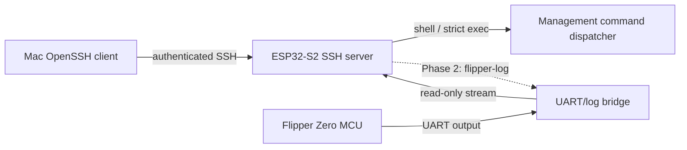

# SSH Access for the ESP32-S2 Wi-Fi Board

**Status:** Proposed

This document describes a possible architecture. SSH is **not implemented** in the
current firmware, and the client commands below are illustrative acceptance-test
commands, not instructions for current releases.

## Context and terminology

The **ESP32-S2 Wi-Fi board** runs this repository's firmware and provides network,
USB, UART, and debug services. It is distinct from the **Flipper Zero MCU** to which
the board is attached. An SSH server on the ESP32-S2 would add an authenticated,
encrypted transport only to services that the firmware explicitly implements. It
would not add Linux, POSIX, or a general-purpose Unix shell.

Current behavior, as verified in the source, is:

- Startup initializes NVS and networking, then HTTP, GDB, and raw UART network
  servers, followed by USB and the management CLI UART; the Blackmagic GDB loop
  runs in its own task (`main/main.c`).
- The ESP32 management CLI is a command registry and line editor with callback-based
  output. It is currently instantiated on UART1 at 115200 baud, with 64-byte TX/RX
  chunks and a bounded RX stream that drops overflow (`main/cli/cli.c`,
  `main/cli-uart.c`, and `main/cli/cli-commands.c`). This is board management, not
  the stock Flipper CLI.
- The separate Flipper-facing UART0 path defaults to 230400 baud. Bytes received
  from the Flipper are copied to USB CDC, the HTTP WebSocket stream, and (when a
  client is connected) raw TCP; writes in the other direction are possible from
  WebSocket, USB, and raw TCP (`main/usb-uart.c`, `main/network-http.c`, and
  `main/network-uart.c`). The source presents this as a UART/log bridge; it does not
  establish that the stock Flipper CLI protocol is available.
- The HTTP server serves the embedded landing page at `/`, configuration UI at
  `/config`, REST endpoints under `/api/v1/`, and a bidirectional UART WebSocket at
  `/api/v1/uart/websocket` (`main/network-http.c` and
  `components/svelte-portal`). No HTTP authentication check is present in the
  current handlers.
- Raw IPv4 TCP port **3456** accepts one UART bridge connection and can both receive
  Flipper UART data and write data toward the Flipper (`main/network-uart.c`). Raw
  IPv4 TCP port **2345** exposes the Blackmagic GDB packet path, accepting one
  connection when DAP-Link is not connected (`main/network-gdb.c`). Neither listener
  authenticates or encrypts its connection.



## Goals

- Allow public-key-authenticated access from a standard macOS OpenSSH client.
- Reuse existing management handlers through a transport-independent session
  interface; do not duplicate command logic for SSH.
- Provide a bounded interactive management shell and, where feasible, strict
  one-shot command execution.
- Later provide an encrypted, read-only Flipper log subsystem.
- Preserve normal startup, Blackmagic debugging, the landing page, `/config`, and
  the existing HTTP API.

## Explicit non-goals

- Bash, zsh, a POSIX process model, package management, nginx, systemd, Docker,
  arbitrary binary execution, and on-device compilation.
- SFTP, SCP, rsync, agent or X11 forwarding, arbitrary port forwarding, tunneling,
  and Unix user accounts.
- Claiming that the stock Flipper CLI is reachable over the current UART wiring.
- Automatic access to Flipper storage, applications, IR, NFC, RFID, Sub-GHz, GPIO,
  or input controls.
- Recommending direct exposure of SSH to the public Internet.

## Phased architecture

### Phase 1: ESP32-S2 management

SSH terminates on the ESP32-S2 and exposes the existing board-management command
handlers. Authentication maps to one fixed logical username, initially `flipper`;
there is no multi-user model.

An interactive `shell` channel provides only minimal terminal behavior: bounded
line input, command echo, CRLF normalization, backspace, Ctrl-C cancellation, and a
prompt. An optional `exec` channel accepts exactly one registered command and its
validated arguments (for example, `ssh flipper.local device_info`). It does not
invoke a command interpreter. Shell expansion, pipelines, redirects, environment
execution, and arbitrary command strings are rejected.

When implementation starts, refactor only the input/output plumbing needed to give
each transport an independent session context. The registry and handlers in
`main/cli/cli-commands.c` remain shared by UART and SSH; the callback model already
visible in `main/cli/cli.c` is the starting seam. UART behavior must remain intact.

### Phase 2: read-only Flipper logs

Add a named subsystem such as `flipper-log` around the existing UART0 receive/fanout
path in `main/usb-uart.c`. It is a read-only byte stream by default, with fixed-size
buffers, explicit drop/disconnect policy, and backpressure that cannot stall UART
handling. It is not a full Flipper shell. Bidirectional UART access remains out of
scope until its safety properties and Flipper-side protocol are defined.

### Phase 3: authenticated Flipper RPC/CLI bridge

A future authenticated bridge requires corresponding Flipper-side firmware or
application work. Conditional capabilities might include a deliberately scoped RPC
method or a purpose-built CLI endpoint, but not implicit peripheral or storage
access. This requires a separate threat model, protocol design, and implementation;
it is not an extension automatically supplied by SSH.

## Authentication and provisioning

- SSH is disabled until at least one authorized public key has been provisioned.
- Use public-key authentication only. Do not offer password fallback or reuse the
  Wi-Fi password.
- Select modern algorithms supported by both the chosen embedded server and current
  OpenSSH clients. Ed25519 must not be promised until compatibility is verified.
- Generate the host private key on-device with the ESP-IDF cryptographic RNG,
  persist it across normal reboots, and expose only its public fingerprint.
- Factory reset must remove authorized keys and rotate the host key. A client must
  then treat the device as newly enrolled.
- If NVS encryption, flash encryption, or secure boot is absent, persisted host and
  authorization data lacks strong at-rest protection against physical extraction or
  modification. The UI must state the effective protection rather than imply it.
- Initial enrollment uses a trusted local path such as USB/serial. The existing
  unauthenticated HTTP configuration UI must not become the sole trust root.
- A later `/config` section may display SSH status, port, host-key fingerprint, and
  authorized-key fingerprints. Web key changes require a separately approved secure
  enrollment or physical-presence mechanism.
- Private host-key material, Wi-Fi passwords, and other secrets must never appear in
  UI/API responses, logs, or SSH command output.

Configuration updates must use validated, atomic NVS writes. Missing, corrupt, or
incomplete SSH state fails closed: SSH stays disabled, other services continue, and
local recovery/enrollment remains available.

## Remote command authorization

The current registry (`main/cli/cli-commands.c` and
`main/cli/cli-commands-config.c`) needs a separate, explicit remote-access policy;
successful SSH authentication does not make every local command safe. A preliminary
inventory is:

| Class | Representative current commands | Proposed remote treatment |
| --- | --- | --- |
| Read-only diagnostics | `help`, `ping`, `device_info`, `wifi_ip`, `wifi_sta_info`, `wifi_ap_clients`, `wifi_scan`, `gpio_get` | Allow only after reviewing output, cost, and hardware sensitivity; rate-limit expensive scans. |
| State-changing administration | `config_set_wifi_mode`, `config_set_usb_mode`, `config_set_ap_ssid`, `config_set_sta_ssid`, `config_set_hostname`, password setters, `gpio_set`, `led`, `reboot` | Deny by default or require a distinct administrative policy and argument validation. Password setters accept secrets and require non-echoing, non-logging handling. |
| Destructive or secret-bearing | `factory_reset`, `config_get`, `nvs_dump` | Initially deny. Gate destructive actions with an approved confirmation/physical-presence design. |

The remote form of `config_get` must redact AP and station credentials; the current
local handler prints both (`main/cli/cli-commands-config.c`). Never expose unrestricted
`nvs_dump`, even though its current implementation lists NVS namespaces, keys, and
types. `factory_reset` currently erases NVS and must be disabled remotely at first or
strongly gated. Aliases inherit the canonical command's policy, and unregistered or
policy-denied commands fail without revealing sensitive details.

## SSH library decision

Use a maintained SSH **server** implementation; do not implement SSH framing, key
exchange, or cryptography from scratch. Evaluate candidates with a reproducible
build-and-memory spike against:

- ESP-IDF 4.4 and ESP32-S2 compatibility;
- server mode, public-key authentication, `shell`, `exec`, and subsystem channels;
- bounded RAM, task, socket, and flash cost;
- maintenance and security-update status;
- interoperability with current macOS OpenSSH clients; and
- compatibility with this project's GPLv3 licensing (`LICENSE`).

The exact library and algorithm set remain open decisions until primary
documentation and a reproducible build establish them. This design makes no
unverified compatibility or licensing claim.

## Runtime and failure behavior

- Start SSH only after networking is usable and authorized keys plus a valid host
  key are available. Default availability is station mode on the local LAN; AP-mode
  exposure requires an explicit policy decision.
- Allocate fixed limits for packet/line/output buffers, authentication attempts,
  tasks, sockets, and channel count. Start with one active session and an idle
  timeout; rate-limit repeated authentication failures.
- Isolate the SSH task and failure paths. Allocation, bind, handshake, or session
  failure must not block boot, watchdog servicing, HTTP configuration, UART work,
  GDB, or firmware recovery.
- Explicitly reject unsupported channels, subsystems, PTY features, forwarding,
  environment, and agent/X11 requests. A requested PTY may only negotiate the
  documented minimal terminal behavior.
- Normalize CR and LF without double execution. Ctrl-C clears the current bounded
  command and returns a prompt; it does not signal a POSIX process. On disconnect,
  discard incomplete input and release all session resources. Output uses bounded
  queues and resumes partial writes; a persistently slow client is disconnected
  rather than blocking a producer.
- Commit configuration atomically. On corrupt/incomplete NVS state, disable SSH,
  record a non-secret diagnostic, and preserve local recovery.

## Related insecure services

SSH does not secure or encapsulate the current unauthenticated listeners on TCP
3456 (`main/network-uart.c`) and TCP 2345 (`main/network-gdb.c`). Once Phase 2 is
available, disable raw UART port 3456 by default; if retained, require an explicit
developer-mode override with a clear warning. GDB exposure is a separate future
hardening item. Documentation and UI must not imply that enabling SSH protects GDB.

## Threat model

In scope are unauthorized local-network devices, brute-force and authentication
abuse, malformed or malicious SSH clients, resource-exhaustion denial of service,
leaked authorized private keys, secret disclosure, and unsafe administrative
commands. Controls include public-key-only authentication, attempt/session limits,
strict parsers and channel rejection, bounded resources, key revocation, redaction,
and command allowlists with least privilege.

Physical possession, invasive flash extraction, router compromise, and hostile
firmware are out of scope. Consequently, the trust boundary assumes trusted running
firmware, an uncompromised LAN path to the board, and physical/flash protections
appropriate to the deployment; absent secure-boot or encrypted-flash protections
we do not claim resistance to local extraction or firmware replacement. For remote
access, use a VPN into the trusted LAN rather than forwarding the SSH port from the
public Internet.

## Verification and rollout

### Phase 1 acceptance

- A correct key authenticates; a wrong, removed, or malformed key is rejected, with
  no password fallback.
- The host fingerprint remains stable across normal reboots. Factory reset removes
  authorized keys and rotates the host key.
- The bounded interactive shell works, including CRLF, Ctrl-C, partial writes, idle
  timeout, and disconnect cleanup. If shipped in Phase 1, one-shot `exec` runs one
  allowed command and rejects chaining, unsupported channels, and unsafe commands.
- `/`, `/config`, the HTTP API, UART logging, and Blackmagic debugging operate
  concurrently during successful sessions and authentication floods.
- Malformed input, slow readers, repeated failed authentication, and abrupt
  disconnects recover cleanly. Peak/steady RAM, task, socket, and flash use are
  measured on the ESP32-S2 and remain within budgets established by the library
  spike. Logs and responses contain no secrets.

### Phase 2 and Phase 3 acceptance

Phase 2 additionally verifies that `flipper-log` is read-only, preserves the existing
UART/USB/WebSocket fanout, has measured bounded buffering, and follows its documented
slow-client policy. Port 3456 follows the selected migration policy. Phase 3 cannot
start until its separate Flipper-side protocol, authorization, safety, and recovery
criteria are approved and tested on both MCUs.

Proposed macOS client checks (not available in current firmware):

```console
# Interactive Phase 1 management session
ssh -o PreferredAuthentications=publickey flipper@flipper.local

# Optional strict one-shot Phase 1 command
ssh -o PreferredAuthentications=publickey flipper@flipper.local device_info

# Phase 2 read-only subsystem
ssh -s flipper@flipper.local flipper-log
```

Roll out disabled-by-default behind explicit provisioning, first to development
hardware, then to opt-in test devices after resource and coexistence results are
recorded. A firmware rollback must still boot and retain local USB/serial recovery;
it must not expose or misinterpret SSH NVS data. Recovery documentation must cover
local key replacement and factory reset. If SSH initialization destabilizes normal
services, disable it without removing the established HTTP, UART, USB, or GDB paths.

## Open decisions

- SSH library and supported host/user-key, key-exchange, cipher, and MAC algorithms.
- Default TCP port.
- Maximum authorized keys and concurrent sessions.
- Initial enrollment and physical-presence mechanism.
- Exact remotely available management-command allowlist and administration policy.
- AP-mode availability.
- Raw UART port 3456 migration and developer-mode behavior.
- Whether one-shot `exec` ships in Phase 1 or follows the interactive shell.
- Host-key storage protection, backup prohibition, and rotation policy.
