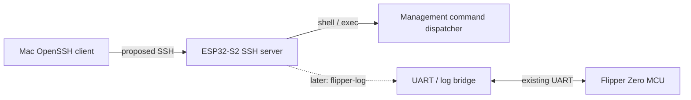

# SSH Access for the ESP32-S2 Wi-Fi Board

**Status:** Proposed

This document describes a possible SSH service. Nothing described as proposed is
implemented by the current firmware.

## Context and terminology

The **ESP32-S2 Wi-Fi board** runs this repository's firmware and provides Wi-Fi,
USB, web, UART bridging, and Blackmagic/DAPLink integration. The **Flipper Zero**
is a separate device with its own MCU and firmware. An SSH server on the ESP32-S2
would not run on, or automatically grant control of, the Flipper MCU.

SSH would be an authenticated, encrypted transport to services explicitly
implemented in the ESP32-S2 firmware. It would not create Linux, POSIX, or a
general-purpose Unix shell.

### Current behavior

- Startup initializes NVS and networking, then starts HTTP, GDB, and raw UART
  network servers before USB, the management CLI, and the GDB task
  (`main/main.c`). There is currently no SSH initialization or server.
- The ESP32 management CLI is a command registry and dispatcher with callback-
  based output (`main/cli/cli.c`, `main/cli/cli-commands.c`). Its current
  transport is a dedicated 115200-baud UART on UART1, pins 17/18. A FreeRTOS
  stream buffer carries received bytes to a CLI instance, while a 64-byte output
  buffer is written back to UART (`main/cli-uart.c`). This is the board-management
  CLI, not evidence that the stock Flipper CLI is available.
- The Flipper-facing data/log path uses UART0 on pins 43/44, initially at 230400
  baud. Received bytes are copied to USB CDC, the HTTP WebSocket stream, and an
  active raw TCP UART client; traffic in the other direction can be written to
  the UART (`main/usb-uart.c`). The raw, unauthenticated IPv4 listener binds all
  interfaces on TCP port 3456 and permits one queued connection
  (`main/network-uart.c`).
- The unauthenticated HTTP server serves the landing page at `/`, the Svelte
  configuration UI at `/config`, system/Wi-Fi/UART APIs, and a bidirectional UART
  WebSocket at `/api/v1/uart/websocket` (`main/network-http.c`,
  `components/svelte-portal`). The current Wi-Fi credentials API and
  `config_get` command return stored passwords, a behavior that must not be
  inherited by SSH (`main/network-http.c`, `main/cli/cli-commands-config.c`).
- The unauthenticated IPv4 GDB listener binds all interfaces on TCP port 2345,
  accepts one queued connection, and connects network GDB traffic to the existing
  Blackmagic GDB glue when DAPLink is not connected (`main/network-gdb.c`).



Solid arrows from the SSH server are Phase 1; the dotted arrow is Phase 2. The
UART link is existing and does not imply access to a general Flipper shell.

## Goals

- Authenticate a standard macOS OpenSSH client with a public key.
- Reuse existing management command handlers through a transport-independent
  session interface instead of duplicating command logic.
- Provide a bounded interactive management shell and, where feasible, strict
  one-shot command execution.
- Later provide an encrypted, read-only Flipper log subsystem.
- Preserve normal startup, Blackmagic debugging behavior, the landing page,
  `/config`, and the existing HTTP API.

## Explicit non-goals

- Bash, zsh, a POSIX process model, a package manager, nginx, systemd, Docker,
  arbitrary binary execution, on-device compilation, or any Unix environment.
- SFTP, SCP, rsync, SSH agent or X11 forwarding, arbitrary port forwarding,
  tunneling, or Unix user accounts.
- A claim that the stock Flipper CLI is reachable through the current UART link.
- Automatic access to Flipper storage, applications, IR, NFC, RFID, Sub-GHz,
  GPIO, input controls, or any other Flipper facility.
- Direct exposure of SSH or any current listener to the public Internet.

## Phased architecture

### Phase 1: ESP32-S2 management

SSH terminates on the ESP32-S2 and exposes only the board-management CLI. Use a
fixed logical username such as `flipper`; there is no multi-user model. A
`session` channel may request an interactive `shell` with only the minimal line
editing and terminal behavior needed by the existing CLI.

An optional `exec` request runs exactly one command from the remote-approved
registry, for example `ssh flipper.local device_info`. It is parsed as a command
name and its command-specific bounded arguments, not passed to a shell. Shell
expansion, pipelines, redirects, environment execution, multiple commands, and
arbitrary command strings are rejected.

When implementation begins, refactor only the CLI input/output plumbing needed
to create a session per transport. UART and SSH must share the registry and
handlers; SSH must not introduce parallel command implementations. The current
`Cli` write/flush callbacks in `main/cli/cli.c` are a useful boundary, but the
exact interface is an implementation decision.

### Phase 2: read-only Flipper logs

Add a named subsystem such as `flipper-log` around the receive side of the
existing Flipper-facing UART flow in `main/usb-uart.c`. It is read-only by
default, uses bounded buffering and backpressure, and closes or drops data under
a documented overflow policy without blocking UART processing. This is a log
stream, not a full Flipper shell. Bidirectional UART access remains out of scope
until its safety properties and Flipper-side protocol are defined.

### Phase 3: authenticated Flipper bridge

A future authenticated Flipper RPC/CLI bridge requires corresponding Flipper-
side firmware or application work. Conditional examples might include querying
an explicitly exported status value or invoking a narrowly authorized RPC.
Capabilities depend on a defined Flipper protocol and authorization model. This
is a separate design and implementation effort, not an extension implied by
Phases 1 or 2.

## Authentication and provisioning

- SSH is disabled by default and does not listen until at least one valid
  authorized public key is provisioned.
- Permit public-key authentication only. Do not implement password fallback or
  reuse the Wi-Fi password. Prefer modern algorithms supported by both the
  selected embedded library and current OpenSSH clients; do not promise Ed25519
  until compatibility is demonstrated.
- Generate the host private key on-device with the ESP-IDF cryptographic RNG,
  persist it across ordinary reboots, and expose only its public fingerprint.
  Factory reset must delete authorized keys and rotate the host key so that the
  next enrollment produces a different fingerprint.
- Store configuration with atomic/versioned NVS updates. If NVS encryption,
  flash encryption, or secure boot is not enabled, document that stored host and
  authorization material is not protected against offline flash access or
  firmware replacement. SSH transport encryption does not provide at-rest
  protection.
- Initial enrollment must use a trusted local mechanism such as USB/serial. The
  current unauthenticated HTTP configuration UI must not be the sole trust root.
- A later `/config` section may display enablement, port, host-key fingerprint,
  and authorized-key fingerprints. Web key addition/removal requires a separately
  designed secure enrollment or physical-presence check.
- Never return a private host key, Wi-Fi password, or other secret through the
  UI, API, logs, or SSH command output.

## Remote command authorization

The current registry in `main/cli/cli-commands.c` includes the following
representative classes. Classification is a review input, not permission by
itself:

| Class | Representative current commands | Proposed initial treatment |
| --- | --- | --- |
| Read-only diagnostics | `device_info`, `ping`, `wifi_ip`, `wifi_sta_info`, `wifi_ap_clients`, `wifi_scan`, `gpio_get`, `help` | Individually review and allow only bounded, non-secret output. |
| State-changing administration | `config_set_wifi_mode`, `config_set_usb_mode`, `config_set_ap_ssid`, `config_set_sta_ssid`, `config_set_hostname`, password setters, `gpio_set`, `led`, `reboot` | Deny initially or require an explicit per-command policy and argument limits. Password setters need secret-safe input and logging rules. |
| Destructive or secret-bearing | `factory_reset`, `config_get`, `nvs_dump` | Disable or tightly gate. Redact both AP and station credentials from `config_get`; never expose unrestricted `nvs_dump`; initially disable `factory_reset` unless a separate confirmation/physical-presence policy is approved. |

The SSH command registry must carry an explicit remote-access policy independent
of the local UART registry, including argument and output limits. Successful SSH
authentication alone does not make every local diagnostic or administrative
handler safe for remote use.

## SSH library decision

Use a maintained SSH server implementation. Do not implement SSH framing, key
exchange, or cryptography from scratch. Evaluate candidates with a reproducible
spike covering:

- ESP-IDF 4.4 and ESP32-S2 compatibility;
- SSH server operation, public-key authentication, and `shell`, optional `exec`,
  and named-subsystem channel support;
- measured RAM, task stack, socket, and flash costs;
- maintenance status and security-update process;
- interoperability with current macOS OpenSSH clients; and
- compatibility with this project's GPLv3 licensing.

The exact library and algorithms remain an explicit decision until primary
documentation and a reproducible build-and-memory result establish suitability.
This design makes no unverified compatibility or licensing claim.

## Runtime and failure behavior

- Start SSH only after networking is usable and authorized-key/host-key state is
  valid. Default to station-mode, local-LAN availability. AP-mode exposure is a
  separate explicit policy decision.
- Bound all allocations, packet/line/argument/output sizes, queues, task stacks,
  sockets, and authentication work. Rate-limit attempts, impose an idle timeout,
  and initially allow one active session.
- Isolate the service so allocation, bind, authentication, protocol, or client
  failures cannot block boot, HTTP configuration, UART handling, GDB, watchdog
  servicing, or firmware recovery. Reject unsupported channels, subsystems,
  forwarding, and global requests explicitly.
- In an interactive session, normalize CR and CRLF to one command terminator.
  Ctrl-C cancels and clears the current input without killing firmware work;
  behavior for a command that cannot safely be interrupted must be documented.
  EOF/disconnect releases all session resources. Output writers must handle
  partial writes, bounded waits, disconnects, and slow clients without blocking
  shared handlers indefinitely.
- Persist complete, versioned configuration atomically. Missing, corrupt, or
  incomplete SSH NVS state fails closed: do not listen, preserve local recovery,
  and report only a non-secret diagnostic over the trusted local path.

## Related insecure services

SSH does not authenticate or encrypt the current TCP UART listener on port 3456
or GDB listener on port 2345 (`main/network-uart.c`, `main/network-gdb.c`). Once
Phase 2 is available, disable raw port 3456 by default; if retained, require an
explicit developer-mode override with a clear warning. GDB exposure is a related
future hardening item. It is not tunneled through or protected by this proposal.

## Threat model

In scope are unauthorized local-network devices, brute-force and authentication
abuse, malicious SSH clients and malformed protocol input, resource-exhaustion
denial of service, leaked authorized private keys, secret disclosure through
commands/logs/errors, and unsafe administrative commands. Mitigations include
key-only authentication, attempt and resource limits, strict parsing, explicit
channel and command allowlists, output redaction, timeouts, safe revocation, and
fault isolation.

Physical possession, invasive flash extraction, router compromise, and hostile
firmware are out of scope. Consequently, the trust boundary assumes the board's
firmware and local network path have not been replaced or fully compromised;
platform flash/NVS protection determines resistance to physical extraction.
Leaked client keys must be removable through the trusted enrollment path. For
remote access, use a VPN into the local network rather than forwarding the SSH
port from the public Internet.

## Verification and rollout

### Phase 1 acceptance

- A provisioned correct key logs in; a wrong or removed key is rejected, and
  there is no password fallback.
- The host fingerprint is stable across normal reboots. Factory reset removes
  all authorized keys and rotates the host key.
- The bounded interactive shell works. If `exec` ships in Phase 1, exactly one
  allowed management command works; chaining, unsafe commands, unsupported
  channels, subsystems, and forwarding requests are rejected.
- `/`, `/config`, the HTTP API, management UART, UART logging, and Blackmagic
  debugging continue concurrently under successful and failed SSH traffic.
- Disconnects, idle sessions, partial writes, malformed input, and repeated
  failed authentication clean up without leaks, stalls, or reboot loops.
- Peak and steady-state internal/PSRAM, task stacks, task count, sockets, and
  firmware flash growth are measured on an ESP32-S2 and remain within budgets set
  before merge. Logs, responses, crash output, and commands contain no secrets.

### Phase 2 acceptance

- `flipper-log` delivers UART receive data read-only while rejecting writes and
  other subsystem names.
- Slow and disconnected clients exercise the documented bounded-buffer and
  backpressure/overflow behavior without disrupting USB, WebSocket, UART, HTTP,
  GDB, watchdog, or recovery paths.
- The port 3456 default/migration and developer override are tested and
  documented; Phase 1 criteria remain passing.

Phase 3 requires its own acceptance plan after its protocol and Flipper-side work
are designed.

The following macOS commands are **proposed examples only; they do not work until
the relevant phase is implemented**:

```sh
# Phase 1 interactive board-management session
ssh -i ~/.ssh/flipper_board flipper@flipper.local

# Phase 1 optional one-shot registered command
ssh -i ~/.ssh/flipper_board flipper@flipper.local device_info

# Phase 2 read-only log subsystem
ssh -i ~/.ssh/flipper_board -s flipper@flipper.local flipper-log
```

Roll out disabled-by-default behind an explicit configuration gate. Retain
USB/serial enrollment and firmware flashing as recovery paths. A failed upgrade
must leave SSH disabled rather than accepting weaker authentication. Rollback
must not export keys or silently restore port 3456; if an older firmware cannot
understand the versioned SSH state, it must ignore it safely. Recovery and
factory-reset procedures must remain available without a working SSH service.

## Open decisions

- SSH library and supported host-key, user-key, key-exchange, cipher, and MAC
  algorithms.
- Default port.
- Maximum authorized keys and simultaneous sessions.
- Enrollment and physical-presence mechanism.
- Exact remotely available management commands and their per-command policy.
- AP-mode behavior.
- Raw UART port 3456 migration and developer-mode override.
- Whether one-shot `exec` ships in Phase 1 or follows the interactive shell.
- Host-key storage protection and rotation policy beyond factory reset.
