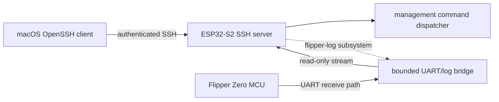

# SSH Access for the ESP32-S2 Wi-Fi Board

**Status:** Proposed

## Context and terminology

The **ESP32-S2 Wi-Fi board** runs this repository's firmware and is a separate
computer from the **Flipper Zero MCU** to which it is attached. SSH would add an
authenticated, encrypted transport to services explicitly implemented in the
ESP32-S2 firmware. It would not add Linux, POSIX, or a general-purpose Unix
shell to either device.

Current behavior, which this proposal does not describe as SSH:

- Startup initializes NVS and networking, then the HTTP, GDB, and UART network
  servers, USB, a board-management CLI on UART1, and the GDB task
  (`main/main.c`, `main/cli-uart.c`). The management CLI has a registered command
  table and callback-based output; it performs simple line editing and command
  dispatch rather than running processes (`main/cli/cli.c`,
  `main/cli/cli-commands.c`).
- The Flipper-facing UART is UART0 at 230400 baud. Received bytes feed USB CDC,
  the HTTP WebSocket, and (when connected) raw TCP UART; traffic received from
  the WebSocket or TCP socket is written back to that UART (`main/usb-uart.c`,
  `main/network-http.c`, `main/network-uart.c`). This is a byte bridge/log path,
  not evidence that the stock Flipper CLI is available.
- The HTTP server currently has no authentication. It serves the landing page
  at `/`, the Svelte configuration UI at `/config`, and JSON APIs. Credential
  responses redact AP and station passwords, and password writes explicitly
  distinguish keeping, replacing, and clearing each stored value. However,
  state-changing routes such as `/api/v1/wifi/set_credentials` and
  `/api/v1/system/reboot` remain unauthenticated, as does the bidirectional UART
  bridge at `/api/v1/uart/websocket` (`main/network-http.c`,
  `components/svelte-portal`).
- IPv4 listeners bound to all interfaces expose bidirectional raw UART on TCP
  port 3456 and Blackmagic GDB transport on TCP port 2345. Each listener accepts
  one connection at a time (`main/network-uart.c`, `main/network-gdb.c`).

Proposed data flow (dashed links are later phases):



## Goals

- Permit public-key-authenticated access from a standard macOS OpenSSH client.
- Reuse existing management handlers through a transport-independent session
  interface instead of duplicating command logic.
- Provide a bounded interactive management shell and, where safe and feasible,
  strict one-shot command execution.
- Later provide an encrypted, read-only Flipper log subsystem.
- Preserve normal startup, Blackmagic debugging, the landing page, `/config`,
  and the existing HTTP API.

## Explicit non-goals

- Bash, zsh, a POSIX process model, package management, nginx, systemd, Docker,
  arbitrary binary execution, on-device compilation, or a general Unix shell.
- SFTP, SCP, rsync, SSH agent or X11 forwarding, arbitrary port forwarding,
  tunneling, or Unix user accounts.
- A claim that the stock Flipper CLI is reachable over the current UART.
- Automatic access to Flipper storage, applications, IR, NFC, RFID, Sub-GHz,
  GPIO, or input controls.
- Direct exposure of SSH to the public Internet.

## Phased architecture

### Phase 1: ESP32-S2 management

SSH terminates on the ESP32-S2 and exposes the existing board-management CLI.
Use one fixed logical username, such as `flipper`, with no multi-user model. A
`shell` channel provides minimal terminal behavior. It is a firmware command
interface, not a Unix shell.

An optional `exec` channel accepts exactly one registered command and its
validated arguments. It must never invoke a shell or accept shell expansion,
pipelines, redirects, environment execution, command chaining, or arbitrary
command strings. For example, the intended shape is
`ssh flipper@flipper.local device_info`, subject to the remote policy below.

Only when implementation starts, separate the CLI's input/output session
plumbing from its command registry. Preserve one set of command handlers for
UART and SSH transports (`main/cli-uart.c`, `main/cli/cli.c`,
`main/cli/cli-commands.c`).

### Phase 2: read-only Flipper logs

Add a named subsystem such as `flipper-log` around the existing Flipper-facing
UART receive path in `main/usb-uart.c`. It is read-only by default and uses
bounded buffering, explicit backpressure/drop accounting, and a slow-client
policy. It is not a full Flipper shell. Bidirectional UART access remains out of
scope until its safety properties and Flipper-side protocol are defined.

### Phase 3: authenticated Flipper bridge

A future Flipper RPC/CLI bridge requires corresponding Flipper-side firmware or
application work. Conditional capabilities might include narrowly authorized
status queries or application-defined RPC actions, but they are not promised by
this design. Protocol, authorization, and safety require a separate design and
implementation effort.

## Authentication and provisioning

- SSH remains disabled until at least one authorized public key is provisioned.
  Authentication is public-key only: no passwords, password fallback, or reuse
  of the Wi-Fi password.
- Choose modern algorithms supported by both the selected embedded library and
  current OpenSSH clients. Ed25519 must not be promised until compatibility is
  verified.
- Generate the host key on-device with the ESP-IDF cryptographic RNG, persist it
  across normal reboots, and expose only its public fingerprint. Factory reset
  must delete authorized keys and rotate the host key.
- Initial enrollment uses a trusted local path such as USB/serial. The current
  unauthenticated HTTP configuration UI must not become the sole trust root.
- A later `/config` section may display SSH status, port, host-key fingerprint,
  and authorized-key fingerprints. Web-based key changes require a separately
  approved secure-enrollment or physical-presence mechanism.
- If NVS encryption, flash encryption, or secure boot is not enabled, stored
  keys and configuration are not protected against offline flash access or
  firmware replacement. Record the actual build's protections during rollout.
- Never return private host-key material, Wi-Fi passwords, or other secrets in
  UI/API responses, logs, or SSH command output.

Persist updates atomically where NVS permits. On corrupt, incomplete, or
inconsistent SSH state, fail closed: do not start SSH, retain recovery through
the trusted local enrollment path, and do not silently generate a new identity
unless the documented recovery/reset operation requests rotation.
Unexpected `nvs_storage` initialization recovery is part of this boundary:
when experimental SSH is enabled, the firmware preserves the partition and
does not start SSH until the physical reset flow or local `factory_reset`
command explicitly erases it. First boot and those explicit resets remain the
only key-absence cases that authorize host-key generation.

## Remote command authorization

The current registry (`main/cli/cli-commands.c` and its command implementation
files) needs a separate, explicit remote-access policy. Representative inventory:

| Class | Existing examples | Initial remote policy |
| --- | --- | --- |
| Read-only diagnostics | `help`, `ping`, `device_info`, `wifi_ip`, `wifi_sta_info`, `wifi_ap_clients` | Allow individually after output/side-effect review. |
| State-changing administration | `led`, `gpio_get`, `gpio_set`, `wifi_scan`, `config_set_wifi_mode`, `config_set_usb_mode`, SSID/password/hostname setters, `reboot` | Deny by default; enable individually with validation and an administration policy. |
| Destructive or secret-bearing | `factory_reset`, `nvs_dump`, current `config_get` | Initially deny or replace with a safe projection. |

`config_get` currently prints AP and station passwords
(`main/cli/cli-commands-config.c`); any remote form must redact credentials.
Unrestricted `nvs_dump` must not be exposed. Gate or initially disable
`factory_reset`, which erases NVS (`main/cli/cli-commands.c`). Successful SSH
authentication alone does not make every local diagnostic or its output safe
for remote use.

Despite its name, `gpio_get` is state-changing: its current implementation
configures requested pins as inputs before reading them, and permits debugging
and CLI UART pins. Keep it disabled remotely unless it is restricted or
reimplemented so a read cannot disrupt debugging or local recovery access.

## SSH library decision

Use a maintained SSH server implementation; do not implement SSH framing, key
exchange, or cryptography from scratch. Evaluate candidates with a reproducible
spike against:

- ESP-IDF 4.4 and ESP32-S2 compatibility;
- SSH server and public-key authentication support;
- `shell`, optional `exec`, and named subsystem channel support;
- measured RAM, task, socket, and flash cost;
- maintenance status and macOS OpenSSH interoperability; and
- compatibility with this project's GPLv3 licensing.

This decision is made, not open: the feasibility spike below records the
selected library with primary documentation and a reproducible build.
Confirming or expanding the supported algorithm set for a production-ready
configuration remains open and is tracked as Phase 1 ("Supported platform
and cryptographic foundation") in
[`ssh-feasibility-spike.md`](./ssh-feasibility-spike.md)'s phased roadmap,
not here. Do not infer compatibility or licensing from a library name alone.

A first reproducible spike against these criteria is recorded in
[`ssh-feasibility-spike.md`](./ssh-feasibility-spike.md): wolfSSH/wolfSSL,
pinned to specific tagged releases, built as a disabled-by-default prototype
that authenticates one public key and answers one exec command. That
document is the completed decision record for the library choice; treat it
as the current source of truth for dependency versions, licensing
conclusions, and measured (or pending) resource costs.

## Runtime and failure behavior

- Start SSH only after networking is available and a valid, enabled SSH
  configuration has loaded successfully. Default availability is station mode
  on the local LAN; AP-mode exposure requires an explicit policy decision.
- Bound all allocations, packets, line lengths, queues, and output. Limit
  authentication attempts, impose an idle timeout, and initially permit one
  active session. A slow writer must yield or disconnect rather than block
  shared UART/network work; partial writes must resume from the unsent offset.
- Isolate errors and task lifecycle so SSH failure cannot block boot, HTTP
  configuration, UART handling, GDB, watchdog servicing, or firmware recovery.
- Explicitly reject unsupported channels, subsystems, forwarding, PTY features,
  and global requests. Normalize CR and CRLF without double execution. Ctrl-C
  cancels the current input/current cancellable command and returns a prompt;
  it does not signal a process. Disconnect clears session state and releases all
  resources, including after partial input/output.
- Configuration writes must be interruption-safe. Invalid state fails closed as
  described under provisioning.

## Related insecure services

SSH does not secure the existing unauthenticated UART listener on port 3456 or
GDB listener on port 2345 (`main/network-uart.c`, `main/network-gdb.c`). Once the
Phase 2 log subsystem is available, disable raw port 3456 by default; retain it,
if needed, only behind an explicit developer-mode override. Treat unauthenticated
GDB exposure as a related future hardening item, not traffic protected by SSH.

## Threat model

In scope are unauthorized local-network devices, brute-force/authentication
abuse, malicious SSH clients and malformed input, resource-exhaustion denial of
service, leaked authorized private keys, secret disclosure, and unsafe
administrative commands. Mitigations include key-only authentication, attempt
limits, strict parsing and channel rejection, bounded resources/timeouts,
revocation through trusted enrollment, output redaction, and command allowlists.

Physical possession, invasive flash extraction, router compromise, and hostile
firmware are out of scope. Consequently, the trust boundary includes the
ESP32-S2 firmware and its configured flash protections, the local network, the
enrollment path, and the operator's private-key storage; SSH cannot compensate
for compromise beneath or outside that boundary. For remote access, use a VPN
into the trusted LAN instead of forwarding the SSH port from the Internet.

## Verification and rollout

All client commands below are **proposed examples for this production
design; they are not implemented**. A disabled-by-default, `ping`-only
feasibility prototype exists (see
[`ssh-feasibility-spike.md`](./ssh-feasibility-spike.md)), but production
SSH — including the management shell and the `device_info`/`flipper-log`
commands shown below — is not, and these examples are not a claim about
default or current firmware behavior:

```console
$ ssh -i ~/.ssh/flipper_id flipper@flipper.local
$ ssh -i ~/.ssh/flipper_id flipper@flipper.local device_info
$ ssh -i ~/.ssh/flipper_id -s flipper@flipper.local flipper-log
```

### Phase 1 acceptance

- Correct keys log in; wrong, removed, malformed, and repeatedly failing keys
  are rejected without password fallback.
- The host fingerprint remains stable over ordinary reboot. Factory reset
  removes authorized keys and rotates the host key.
- Allowed interactive commands work; if `exec` ships, exactly one allowed
  management command works and command chaining/unsafe commands are rejected.
- Unsupported channels, subsystems, forwarding, and requests are rejected.
- `/`, `/config`, HTTP APIs, UART logging, and Blackmagic debugging operate
  concurrently with SSH, including during authentication failures.
- Disconnects, idle sessions, Ctrl-C, CRLF, partial writes, malformed input, and
  repeated authentication failures clean up predictably.
- Peak/steady RAM, task, socket, stack-watermark, CPU, and firmware-flash costs
  are measured on the ESP32-S2 against documented limits. Logs and responses
  contain no keys, Wi-Fi credentials, or other secrets.

### Phase 2 and Phase 3 acceptance

Phase 2 additionally proves that `flipper-log` is read-only, bounded under slow
clients, does not regress existing UART consumers, and cannot inject UART data.
Phase 3 defines its own protocol/security criteria and cannot ship solely on the
basis of Phase 1 or 2 acceptance.

Roll out disabled-by-default, then opt-in for developers, with resource telemetry
and interoperability results recorded before broader enablement. Rollback means
disabling/removing the SSH service without changing existing startup paths.
Recovery must remain possible over the trusted local path even after corrupt
configuration or host-key loss; factory reset restores a disabled, unenrolled
state with a newly generated host identity for the next enrollment.

Preserving `/`, `/config`, and HTTP API functionality does not mean preserving
their current unauthenticated security properties. Hardening the coordinated UI
and API is a prerequisite for SSH rollout. Credential responses are now
redacted, and the UI/API contract distinguishes leaving a stored password
unchanged from explicitly replacing or clearing it. State-changing routes must
still be authenticated, disabled, or equivalently restricted; that remaining
management-plane hardening is not part of this SSH proposal.

## Open decisions

- Production-phase supported algorithm set beyond the feasibility spike's
  restricted profile (see `ssh-feasibility-spike.md`'s Phase 1).
- Default port.
- Maximum authorized keys and sessions.
- Enrollment and physical-presence mechanism.
- Exact remotely available management commands.
- AP-mode behavior.
- Raw UART port 3456 migration and developer override.
- Whether one-shot `exec` ships in Phase 1 or follows the interactive shell.
- Host-key storage protection and rotation policy.
