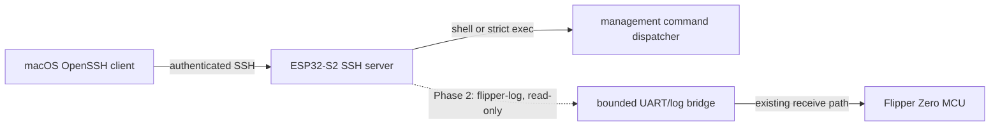

# SSH Access for the ESP32-S2 Wi-Fi Board

**Status:** Proposed

This document describes an architecture, not functionality present in the current
firmware. All SSH names, commands, ports, and client examples below are proposed
unless explicitly identified as current behavior.

## Context and terminology

The **ESP32-S2 Wi-Fi board** runs this repository's firmware and provides Wi-Fi,
USB, configuration, and debug transports. The **Flipper Zero** is a separate MCU
connected to that board. An SSH server on the ESP32-S2 would provide an
authenticated, encrypted transport only to services explicitly implemented by
the firmware. It would not add Linux, POSIX, or a general-purpose Unix shell to
either device.

### Current behavior

- Startup initializes NVS and networking, then starts HTTP, GDB, and raw UART
  network servers before USB, the management CLI, and the Blackmagic GDB task
  (`main/main.c`). There is currently no SSH initialization or server.
- The ESP32 management CLI has its own UART 1 transport at 115200 baud on pins 17
  and 18. Bytes feed `cli_handle_char`; output is returned through callbacks with
  a 64-byte transmit buffer (`main/cli-uart.c`, `main/cli/cli.c`). Its registered
  commands are board-management operations, not a Flipper shell
  (`main/cli/cli-commands.c`).
- The separate Flipper-facing UART uses UART 0 on pins 43 and 44, initially at
  230400 baud. Received bytes are fanned out to USB CDC, the HTTP WebSocket, and
  an attached raw TCP client (`main/usb-uart.c`). The WebSocket can also write
  bytes back to that UART (`main/network-http.c`). This path must not be described
  as exposing the stock Flipper CLI.
- The unauthenticated raw TCP UART bridge listens on all IPv4 interfaces on port
  3456, accepts one client at a time, and is bidirectional
  (`main/network-uart.c`).
- The HTTP server exposes static landing/configuration resources at `/` and
  `/config`, JSON endpoints under `/api/v1/`, and a bidirectional UART WebSocket
  at `/api/v1/uart/websocket` (`main/network-http.c`). The Svelte sources and
  embedded built assets for that interface live in `components/svelte-portal`.
- The unauthenticated Blackmagic GDB TCP listener binds all IPv4 interfaces on
  port 2345 and accepts one client when DAP-Link is not connected
  (`main/network-gdb.c`).

The proposed high-level data paths are:



## Goals

- Allow public-key-authenticated access from a standard macOS OpenSSH client.
- Reuse existing management handlers behind a transport-independent session
  interface; do not duplicate command logic for SSH.
- Provide a bounded interactive management shell and, where feasible, strict
  one-shot execution.
- Later provide an encrypted, read-only Flipper log subsystem.
- Preserve normal board startup, the landing page, `/config`, the HTTP API, UART
  logging, and existing Blackmagic debugging behavior.

## Explicit non-goals

- Bash, zsh, a POSIX process model, a package manager, nginx, systemd, Docker,
  arbitrary binary execution, on-device compilation, or any general Unix shell.
- SFTP, SCP, rsync, SSH agent or X11 forwarding, arbitrary port forwarding,
  tunneling, or Unix user accounts.
- A claim that the stock Flipper CLI is reachable over the current UART wiring.
- Automatic access to Flipper storage, applications, IR, NFC, RFID, Sub-GHz,
  GPIO, or input controls.
- Direct exposure of the SSH port to the Internet.

## Phased architecture

### Phase 1: ESP32 management access

SSH terminates on the ESP32-S2 and exposes the existing board-management command
set. A fixed logical username such as `flipper` identifies the service; there is
no multi-user model.

An interactive `shell` channel provides only minimal terminal behavior required
by the CLI. An optional `exec` channel accepts exactly one registered command and
its validated arguments, for example `ssh flipper.local device_info`. It does not
invoke an interpreter and must reject shell expansion, pipelines, redirects,
environment execution, extra commands, and arbitrary command strings.

When implementation begins, refactor only the CLI input/output plumbing needed
to create an isolated session with bounded input and output. Keep command parsing
and handlers shared by the UART and SSH transports (`main/cli-uart.c`,
`main/cli/cli.c`, and `main/cli/cli-commands.c`). Each transport must have its own
session state and output context.

### Phase 2: read-only Flipper logs

Add a named subsystem such as `flipper-log` around the existing Flipper-facing
UART receive/fan-out path in `main/usb-uart.c`. It is read-only by default, uses
bounded buffering and explicit backpressure/drop accounting, and is not a full
Flipper shell. Bidirectional UART access remains out of scope until both its
safety policy and a Flipper-side protocol are defined.

### Phase 3: authenticated Flipper bridge

A future authenticated Flipper RPC/CLI bridge requires corresponding
Flipper-side firmware or application work. If that protocol is later designed,
conditional capabilities might include narrowly authorized status queries or
application actions. This is a separate design, threat review, and implementation
effort—not an extension implicitly supplied by SSH or the present UART stream.

## Authentication and provisioning

- SSH is disabled by default and cannot listen until at least one authorized key
  has been provisioned.
- Authentication is public-key only. There is no password fallback, and the
  Wi-Fi password is never reused as an SSH credential.
- Select modern algorithms jointly supported by the chosen embedded library and
  current OpenSSH clients. Do not promise Ed25519 until a reproducible
  compatibility test verifies it.
- Generate the host private key on-device with the ESP-IDF cryptographic RNG,
  persist it across ordinary reboots, and expose only its public fingerprint.
  Factory reset must delete all authorized keys and rotate the host key.
- Key material stored in ordinary NVS is recoverable by an attacker able to read
  flash unless appropriate NVS encryption, flash encryption, and secure boot
  protections are enabled. The implementation and UI must accurately report the
  protection actually configured rather than imply at-rest security.
- Initial authorized-key enrollment uses a trusted local mechanism such as USB
  or serial. The current unauthenticated HTTP configuration UI must not become
  the sole trust root.
- A later `/config` section may display enabled state, port, host-key fingerprint,
  and authorized-key fingerprints. Web key addition/removal requires a separately
  designed secure-enrollment or physical-presence check.
- Private host-key material, Wi-Fi passwords, and other secrets must never be
  returned by UI/API responses, logs, or SSH command output.

## Remote command authorization

The current registry in `main/cli/cli-commands.c` needs an explicit, deny-by-
default remote-access policy independent of successful SSH authentication.
Representative initial classifications are:

| Class | Existing examples | Proposed remote treatment |
| --- | --- | --- |
| Read-only diagnostics | `ping`, `device_info`, `wifi_ip`, `wifi_sta_info`, `wifi_ap_clients`, `help` | Allow only after reviewing output for identifiers and secrets; rate-limit costly commands such as `wifi_scan`. |
| State-changing administration | `led`, `gpio_set`, `config_set_wifi_mode`, `config_set_usb_mode`, SSID/hostname/password setters, `reboot` | Deny initially or require a specific command policy and validated arguments. |
| Destructive or secret-bearing | `factory_reset`, `nvs_dump`, current `config_get` | Do not expose unrestricted `nvs_dump`; gate or initially disable `factory_reset`; create a remote-safe `config_get` view that redacts AP and station credentials. |

`gpio_get` also needs a pin-safety review rather than automatic classification as
safe merely because it reads state. The current `config_get` prints both AP and
station passwords (`main/cli/cli-commands-config.c`), so the local handler cannot
be remotely exposed unchanged. Every alias and new command must inherit an
explicit policy entry; authentication alone is not authorization for all local
diagnostics.

## SSH library decision

Use a maintained SSH server implementation. Do not implement SSH framing, key
exchange, authentication, or cryptography from scratch. Selection requires a
small reproducible build-and-memory research spike unless primary documentation
and an existing reproducible build already establish a choice.

Evaluate ESP-IDF 4.4 and ESP32-S2 compatibility, server functionality,
public-key authentication, `shell`/`exec`/subsystem channel support, RAM and flash
cost, maintenance status, interoperability with current macOS OpenSSH, and
compatibility with this project's GPLv3 license (`README.md`, `LICENSE`). The exact
library and algorithm suite remain open; this design makes no unverified
compatibility or licensing claim.

## Runtime and failure behavior

- Start SSH only after networking is usable and a complete, valid SSH
  configuration and authorized key set have loaded. Default to station-mode,
  local-LAN availability; AP-mode exposure is an explicit policy decision.
- Bound packet, line, channel, and output buffers; cap authentication attempts;
  apply an idle timeout; and initially permit one active session. Measure task,
  stack, heap, socket, and flash budgets on the ESP32-S2.
- Isolate service/task failure so SSH cannot block boot, HTTP configuration, UART
  handling, GDB, watchdog servicing, or firmware recovery. Reject unsupported
  channel types, subsystems, forwarding, and global requests explicitly.
- Normalize received CRLF or CR to one command terminator without double
  execution. Ctrl-C cancels the current input/interruptible operation and returns
  to a clean prompt; it never resets unrelated tasks. On disconnect, discard
  partial input, release session resources, and leave global board state valid.
  Output uses bounded queues and correct partial-write retry semantics, with a
  defined timeout/disconnect policy for a client that stops reading.
- Persist configuration atomically where supported. Missing, corrupt, partially
  written, or unsupported-version SSH state fails closed: do not start SSH, do
  not regenerate a trusted host identity silently, report a non-secret local
  diagnostic, and retain USB/serial recovery.

## Related insecure services

SSH does not secure or encapsulate the existing unauthenticated listeners on raw
UART port 3456 (`main/network-uart.c`) or GDB port 2345 (`main/network-gdb.c`).
Once Phase 2 is available, disable port 3456 by default; if retained, require an
explicit developer-mode override with visible status. Network GDB exposure is a
related future hardening item and remains independently reachable until changed.

## Threat model

In scope are unauthorized devices on the local network, brute-force and repeated
authentication abuse, malformed or malicious SSH clients, resource-exhaustion
denial of service, leaked client private keys, disclosure through output/logs,
and unsafe administrative commands. Controls include public-key-only auth,
attempt/session/time limits, bounded parsing and buffering, fingerprint-based
host verification, explicit command authorization, output redaction, and local
key revocation/recovery.

Physical possession, invasive flash extraction, router compromise, and hostile
firmware are out of scope. Consequently, the trust boundary assumes controlled
firmware, a locally administered network, protected client keys, and whichever
hardware-backed storage protections are actually enabled. Remote access should
use a VPN into the trusted LAN rather than forwarding the SSH port from the
public Internet.

## Verification and rollout

### Phase 1 acceptance

- A provisioned correct key logs in; a wrong or removed key is rejected; password
  authentication is never offered as fallback.
- The host fingerprint remains stable across normal reboots. Factory reset
  removes authorized keys, rotates the host key, and leaves SSH disabled.
- The interactive management channel works within its terminal limits. If `exec`
  ships in Phase 1, exactly one allowed command runs and returns a deterministic
  status; extra syntax, unsupported channels, and unsafe commands are rejected.
- `/`, `/config`, HTTP APIs, UART logging, and Blackmagic USB/network debugging
  operate concurrently with SSH (`main/main.c`, `main/network-http.c`,
  `main/network-gdb.c`, and `main/usb-uart.c`).
- Disconnects, idle sessions, partial writes, malformed input, and repeated
  failed authentication cleanly release resources without blocking recovery.
- Peak and steady-state RAM, task/stack, socket, and flash use are measured on an
  ESP32-S2 against documented budgets. Logs and responses contain no credentials,
  private keys, or other secrets.

### Phase 2 and Phase 3 acceptance

Phase 2 additionally verifies that `flipper-log` is read-only, preserves existing
UART consumers, applies bounded buffering/backpressure under a slow client, and
cannot open an arbitrary subsystem. Phase 3 requires its own protocol, Flipper-
side implementation, authorization tests, fuzzing, resource measurements, and
security review before any capability is accepted.

### Proposed macOS examples

These commands are illustrative and will not work until the corresponding phase
is implemented; the final port, algorithms, and enrollment command are undecided.

```console
# Phase 1 interactive management session
ssh flipper@flipper.local

# Phase 1 optional strict one-shot command
ssh flipper@flipper.local device_info

# Phase 2 read-only subsystem
ssh -s flipper@flipper.local flipper-log
```

Roll out behind the default-disabled setting, first to development hardware and
then an opt-in test cohort. Rollback disables the SSH listener without removing
HTTP, UART, USB, or GDB recovery paths. A bad configuration or failed upgrade
must fail closed and remain recoverable over trusted USB/serial; factory reset is
the last-resort recovery and deliberately invalidates prior host trust and keys.

## Open decisions

- SSH library and supported host-key, user-key, key-exchange, cipher, and MAC
  algorithms.
- Default port.
- Maximum authorized keys and active sessions.
- Initial enrollment, later key-management, and physical-presence mechanisms.
- Exact remotely available management commands and per-command argument policy.
- AP-mode availability.
- Migration and developer override for raw UART port 3456.
- Whether one-shot `exec` ships with the Phase 1 interactive shell or follows it.
- Host-key storage protection, explicit rotation, backup, and recovery policy.
